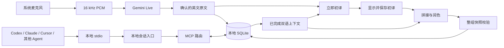

# 架构说明

## 本地启动

`start.cmd` / `start.sh` 先补齐 Node.js 和 npm；`scripts/local.mjs` 管理依赖缓存、构建、迁移、启动互斥与服务复用。`local-server.mjs` 核验 loopback Host / Origin、签发本机会话、清除外来身份头并向构建后的后台注入本地用户。`local-db.mjs` 维护 SQLite 迁移记录与升级备份。`mcp-stdio.mjs` 将桌面 MCP 消息转发至同一后台，所有日志走 stderr。

`scripts/mcp-config.mjs` 生成各客户端 JSON / TOML，网页和导出脚本使用同一生成器。`lib/mcp-protocol.ts` 提供版本协商、结构化工具输出和总结提示模板。只读参数由 stdio 连接传到 HTTP 路由，路由同时隐藏与拒绝写入工具；读取可并发，单个连接内的写入排队，跨连接分析重试使用 UUID 去重。模型在客户端调用，服务不绑定某家 Agent SDK。

本地版本不注册 Sites，也不使用开发模式的身份模拟。Miniflare/workerd 和 D1 SQLite 作为随应用安装的固定本地运行时；Wrangler 只管理迁移。保留原路由和数据访问代码，网页与 MCP 使用相同的本地身份和数据库目录。

## 转写与翻译

Live 默认使用一次性短期令牌，长期密钥不用于浏览器 WebSocket。设备原生采样率通过 AudioWorklet 连续转换为 16 kHz，备用分段模式经服务器转发 WAV。

FastTranslator 对每个确认片段立即请求初译，不等语义断句，慢片段不阻碍其他初译显示。模型可读前面最多 8 个已完成双语单位和约 11,000 字符上下文。

初译队列空闲时约 1.5 秒防抖后整理，最早待处理内容约 6 秒后尝试；持续积压会延后，停止听讲会收尾。窗口最多 20 原始片段、12,000 英文字符和 32,000 中文字符，可重访前面两个完整译文单位，按原片段边界拆分或合并。

整理输出须完整按序覆盖全部 ID。refine 接口比较先前中文和分组快照，原子保存，拒绝覆盖新结果；失败保留初译。drainSaves 先等待最新初译保存，避免旧原文请求响应导致误判。重试同步后可恢复失败整理，英文和时间戳不改写。

## 接口和存储

两个翻译阶段共用网址、协议、模型和密钥池。最多 16 枚密钥，每枚一个活动请求，并发 1–6；轮换空闲密钥，错误后冷却 30 秒，每请求最多尝试 3 枚，仅在当前页面协调。

OpenAI 兼容保留完整聊天端点，模型列表使用同级 /models；DeepSeek 保留原基础网址处理。默认服务端密钥仅用于允许的官方 DeepSeek 地址。SSE 转发字符数与思考状态，完整输出校验后提交，不展示或保存原始推理文本。

classrooms 保存标题、笔记、修订版本和删除时间，segments 保存原文、时间戳、中文和分组，analyses 追加保存分析。所有查询按可信 owner 筛选。删除进入回收站，不提供永久清除 UI。本地身份由独立 loopback 会话入口提供，维持单用户课堂空间；不依赖 Sites 身份注入。

## 关键代码

| 位置 | 职责 |
| --- | --- |
| `app/page.tsx` / `hooks/use-classroom.ts` | 课堂页面、收音、保存与翻译协调 |
| `lib/gemini-live.ts` / `lib/gemini-chunks.ts` | 转写、重连与收尾 |
| `public/pcm-capture.js` | 连续音频转换 |
| `lib/fast-translation.ts` / `lib/save-queue.ts` | 初译、整理与保存等待 |
| `lib/translation-*.ts` | 协议、网址、密钥池及 SSE |
| `app/api/classrooms` / `lib/classroom-store.ts` | 课堂读写、分页、冲突与原子保存 |
| `app/records` | 回看、管理和回收站 |
| `app/mcp/route.ts` / `scripts/mcp-stdio.mjs` | MCP 工具与本地 stdio |
| `scripts/mcp-config.mjs` / `lib/mcp-protocol.ts` | 多客户端配置、只读连接、结构化结果与总结模板 |
| `scripts/local*.mjs` | 独立本地启动、认证、运行时与迁移 |
| `hooks/use-webmcp.ts` | 浏览器课堂只读工具 |
| `drizzle` | D1 迁移 |

音频不持久保存，未同步文本和未发送音频不保证崩溃恢复；localStorage 连接设置并非课堂备份。
